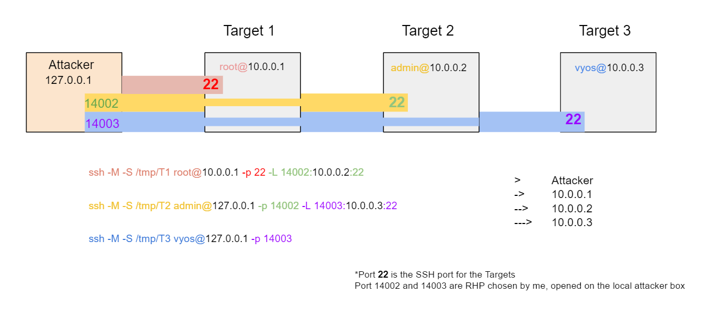

<h1>Tunneling</h1>

[Home](index.html)

[toc]

## SSH


| Option | Description                                                  |
| ------ | ------------------------------------------------------------ |
| `-M`   | Places the SSH client into “Master” mode for connection sharing |
| `-S`   | Create a slave connection using a previously set up master connection. `/tmp/<name>` specifies the location of a control socket for connection sharing. |
| `-L`   | Setting up for a future connection (forward tunnel)          |
| `-R`   | Reverse tunnel                                               |


`ssh -M -S /tmp/T1 user@[1stTarget IP] -p [Target1 SSH port] -L [RHP1]:[Target2 IP]:[Target 2 SSH Port]`

`ssh -M -S /tmp/T2 user@127.0.0.1 -p [RHP1] -L [RHP2]:[3rd Target IP]:[Target 3 SSH Port]`

`ssh -M -S /tmp/T3 user@127.0.0.1 -p [RHP2]`




All the masters (`-M`) are set up and connected in the above diagram.

You can now open a new connection to T2 (target 2) above without opening a separate connection using the socket (`-S`). 

​			`ssh -S /tmp/T2 admin@127.0.0.1 -p 14002`


---


## Reverse Tunnel

<a href="tunneling.html">Top</a>

 `ssh -M -S /tmp/T3 vyos@127.0.0.1 -p 14003 -R 14002:0.0.0.0:14002`

​		set up a nc listener on attack box to receive file from Target 4:  `nc -lvpn 14002 > <filename>`


---


## Banner Grabbing

When you find a new IP of interest add the forward connection to your already created master SSH socketed connection to see if port 22 is open on target machine.	


Already created Master:   `ssh -M -S /tmp/t1 user@<Target 1 IP> -p 22`	

Add the forward tunnel (`-L`):   `ssh -S /tmp/t1 user@<Target 1 IP> -p 22 -L 14002:<newly found ip>:22`

​				`telnet 127.0.0.1 14002`

​				`nc -vn 127.0.0.1 14002`


---

​	

## ProxyChains

<a href="tunneling.html">Top</a>

Setting up proxychains

​	add  `-D 9050 -N -f`  to end of your SSH commands 

​		`ssh -S /tmp/T2  admin@127.0.0.1 -p 14002 -D 9050 -N -f`

​		`-D` local dynamic application-level port forwarding

​		`-N` specifies an alternative per-user configuration file (default: ~/.ssh/config)

​		`-f` requests ssh to go to the backgroup just before command execution


Configure Port

​	`/etc/proxychains.conf`

​	socks4	127.0.0.1	9050

​	

Close proxychains connection

​		`ssh -S /tmp/T2 -O cancel -D 9050 admin@127.0.0.1 -p 14002`


Scan using proxychains

​		`proxychains nc -nz <IP> <port range>`

​		`proxychains nmap -sT -Pn <IP> <port range>`

---


## Network Shell (netsh)

<a href="tunneling.html">Top</a>

Windows utility portproxy

Port forwarding:

set up firewall rule to foward traffic

`netsh interface portproxy add v4tov4 listenport=6969 connectaddress=10.0.0.2 connectport=22`


Show curent portproxies rules

​	`netsh interface portproxy show all`

```
Listen on ipv4:        Connect to ipv4:

Address     Port      Address      Port

------       ------      ------       -----

0.0.0.0      6969      10.0.0.2    22
```


Create a new forward on Target 1

​	`ssh -S /tmp/T1 -p 14001 -L 14002:10.0.0.2:6969`

 

Connect to T2 through the newly established forward tunnel

​	`ssh -M -S /tmp/T2 admin@127.0.0.1 -p 14002`


Delete netsh portproxy

`netsh interface portproxy delete v4tov4 listenport=6969 listenaddress=10.0.0.2 protocol=tcp`

`netsh interface portproxy reset`

`netsh advfirewall firewall delete rule name="<name>"`


---


## IPTables Redirection

<a href="tunneling.html">Top</a>


**Prerouting rules:** 

`iptables -A PREROUTING -t nat -s <kalibox> -d <redirIP> -p tcp --dport <targetport> -j DNAT --to-destination <targetIP>:<targetPort>` 

**Explained:** if you see anything coming from <kalibox> with the destination <redirIP> destined for <targetport> send it to <targetIP> with <targetPort>


**Reverse Translation:** 

`iptables -A PREROUTING -t nat -s <targetIP> -d <redirIP> -p tcp -j DNAT --to-destination <kaliBox>` 

**Explained:** if you see anything coming from <targetIP> with the destination <redirIP> send it to <kaliBox>

<u>Note</u>: you can specify --to-dport so it’ll just be from a specific port rather than a full take of traffic from the <targetIP>


**Postrouting Source IP changes:** 

**Explained:**  The source IP has not changed yet so you need to add postrouting so it’ll go from <targetIP> to <redirIP> to <kaliBox>

**KaliBox to Target:**

`iptables -A POSTROUTING -t nat -s <kalibox> -d <targetIP> -p tcp -j SNAT --to-source <redirIP>`

**Explained:** Anything coming from the <kalibox> that’s destined for the <targetIP> change the source address to the <redirIP>


**Target to KaliBox**:

`iptables -A POSTROUTING -t nat -s <targetIP> -d <kalibox> -p tcp -j SNAT --to-source <redirIP>`

**Explained:** Anything coming from the <targetip> destined for the <kalibox> set the source address to the <redirip>

---

<a href="tunneling.html">Top</a>

