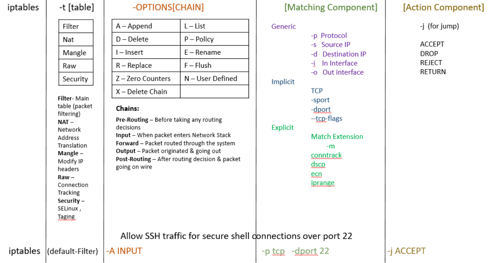

<h1>Helpful Linux Commands</h1>

[Home](index.html)

[toc]

## Helpful Commands

| Description                   | Command                                                      |
| ----------------------------- | ------------------------------------------------------------ |
| ping sweep without nmap       | `for i in {1..254}; do ping -c 1 -W 1 <10.0.0>.$i \| grep 'from'; done` |
| find anything on the system   | `find / -name "term"[.txt, .conf] `                          |
|                               | `-perm ###  (octal)`                                         |
|                               | `-user <username>`                                           |
|                               | `-group <group name>`                                        |
| Compress and send Tar         | local maching:        `nc -lp 1234 | tar xvzf -`             |
|                               | remote machine:   `tar -cvz [filename] | nc <ip> 1234`       |
| OS information                | `cat /etc/*release*`                                         |
|                               | `hostname`                                                   |
| Kernel Modules                | `lsmod`                                                      |
| Startup Scripts (systemd)     | `cat /etc/systemd/systemd`                                   |
|                               | `file /usr/lib/systemd/system`                               |
| Service Status (systemd)      | `systemctl list-units`                                       |
| What starts on boot (systemd) | `systemctl list-unit-files -t service `                      |
| Routing Tables                | `netstat -rn`                                                |
|                               | `route`                                                      |
|                               | `ip route show`                                              |
| Iptables                      | `cat /etc/systconfig/iptables`                               |
|                               | `iptables -nvL`                                              |
| Ports with Services           | `cat /etc/services`                                          |
|                               | `cat /etc/inet/services`                                     |
| Files opened by processes     | `lsof -p <PID>`                                              |
|                               | `lsof -u <user>`                                             |
| SUID SGID FIles               | `find / -perm /4000`                                         |
|                               | `find / -perm /2000`                                         |

---

## Hashing

<a href="helpful_linux.html">Top</a>

Single File: `md5sum /path/to/file`

Directory: `md5sum /path/*`

Same for `sha256sum`

​				 `sha1sum`

---

## Users and Groups

<a href="helpful_linux.html">Top</a>

| Description                                 | Command                             |
| ------------------------------------------- | ----------------------------------- |
| add user                                    | `useradd <username>`                |
| change/set password for user                | `passwd <user>`                     |
| Specify a different home directory          | `useradd -d /newhome/directory`     |
| Add user to multiple groups during creation | `useradd -G admin,group2 <user>`    |
| Add user home directory                     | `useradd -M <user>`                 |
| Add comment to user                         | `useradd -c "Superman" <user>`      |
| Specify users shell                         | `useradd -s /bin/bash <user>`       |
| Check users and groups                      | `cat /etc/passwd && cat /etc/group` |
| Delete user                                 | `userdel <user>`                    |
| Add existing user to a Group                | `usermod -a -G <group> <user>`      |

---

## Security Product Enumeration

<a href="helpful_linux.html">Top</a>

#### Find Security Products

Check `ps -elf` and `/usr/local/bin` for any security products

| SELinux                       |                                          |
| ----------------------------- | ---------------------------------------- |
| Is it installed on the system | `sestatus || getenforce`                 |
| Configuration file            | `cat /etc/selinux/conf`                  |
| Version                       | `cat /etc/selinux/conf`                  |
| Other Checks                  | `/etc/selinux and /usr/bin`              |
| Find Selinux                  | `find / -name *selinux* 2>/dev/null`     |
| Log files                     | `/var/log/audit/audit.log |grep selinux` |

| ClamAV  |               |
| ------- | ------------- |
| Version | `clamscan -V` |

| RKhunter     |                    |
| ------------ | ------------------ |
| System Check | `rkhunter --check` |
| Location     | `/usr/local/bin`   |

| Sophos |                                    |
| ------ | ---------------------------------- |
| Find   | `ls -lisah /opt | grep -i sophos`  |
|        | `cat /opt/sophos-av/bin/savconfig` |

---

#### Find Installed Software

<a href="helpful_linux.html">Top</a>

`ls -latr /usr/bin`

`ls -latr /usr/sbin/`

`ls -latr /user/share`

`ls -latr /etc/`

Running : `ps -elf`

---

## Run Levels and Targets

| Run-level | Target                | Explanation                                                  |
| --------- | --------------------- | ------------------------------------------------------------ |
| **0**     | **poweroff.target**   | This run level/target is used by systemd to power-off or halt the system |
| **1**     | **rescue.target**     | This run level/target is used by systemd to boot the system in rescue or recovery mode. It is very helpful if some goes wrong you can change the configuration in that mode |
| **2**     | **multi-user.target** | This run level/target is used by systemd to boot system into multi-user environment so user can work in parallel |
| **3**     | **multi-user.target** |                                                              |
| **4**     | **multi-user.target** |                                                              |
| **5**     | **graphical.target**  | This run level/target is used by systemd to boot system into multi-user graphical environment so user can work in parallel in graphical mode |
| **6**     | **reboot.target**     | This run level/target is used by systemd to reboot the system |

---

## /etc/shadow

**student**:$6$LKj8SL2rdS$lkSl38Slnww08slsks3LS:17736:0:99999:7:::

| Section               | Description                                                  |
| --------------------- | ------------------------------------------------------------ |
| student               | username                                                     |
| $6$                   | encryption type                                              |
| LKj8SL2rdS$           | password salt                                                |
| lkSl38Slnww08slsks3LS | encrypted Password                                           |
| 17736                 | the date when the password was last changed, number of days since January 1, 1970 (epoch date) |
| 0                     | minimum password age                                         |
| 99999                 | maximum password age                                         |
| 7                     | warning period                                               |
| last three            | inactivity period, expiration date, Unused                   |

<u>Encryption Types:</u>

$1$ – MD5

$2a$ – Blowfish

$2y$ – Eksblowfish

$5$ – SHA-256

$6$ – SHA-512

---

## Process Accounting

Method of recording and summarizing commands executed on Linux 

| Location               | OS                                        |
| ---------------------- | ----------------------------------------- |
| /var/account/acct      | FreeBSD / OpenBSD Default accounting file |
| /var/account/pacct     | Red Hat / RHEL / CentOS / Fedora Linux    |
| /var/log/account/pacct | Debian / Ubuntu Linux                     |
| /var/adm/psacct        | Sun Solaris UNIX Default accounting file  |

---

## Rsyslog

<a href="helpful_linux.html">Top</a>

System in *nix to forward log messages.

Location:  `cat /etc/rsyslog.conf`

​	double `@@` tells rsyslogd to have its datagrams emitted in TCP datagrams

​	single `@` would have it sent out in UDP datagrams.

If you find a website like [badguy:514] in rsyslog look in `/var/www/html` or `etc/hosts`. curl the html and look at log. 

Check netstat for connections on port 514

​		`netstat -auntp | grep "514"`

---

## Iptables

