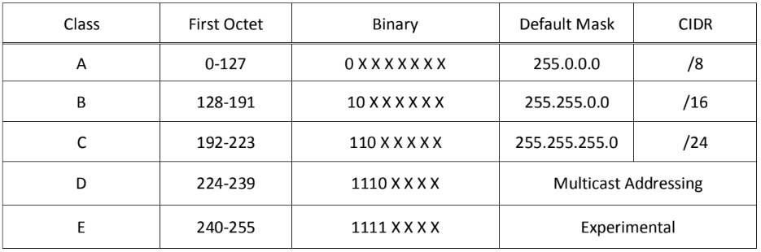

<h1> Introduction to Networking</h1>

[Home](index.html)

[toc]

### Open Systems Interconnection (OSI) Model

demonstrates the theory behind computer networking

| OSI Model    | Description                                                  |
| ------------ | ------------------------------------------------------------ |
| Application  | End-User software such as web browsers. Human-computer interaction layer, where applications can access network services |
| Presentation | translates the data into a standardized format to ensure that data usable. it also handles encryption, compression or other transformations to the data. |
| Session      | Maintains connections and is responsible for controlling ports and sessions |
| Transport    | chooses protocol (TCP/UDP) then divides the transmission up into byte-sized pieces, which makes it easier to transmit the messages successfully |
| Network      | locates the destination/path of your target. Logical Addressing (IP addresses). Figures out the best route to take |
| Data Link    | physical addressing (MAC) of the transmission. receives a packet from network layer and adds the mac address. ensures traffic is not corrupted during transmission |
| Physical     | hardware of the computer. Transmits and receives  raw bit stream over physical medium |


### Encapsulation

[Top](network_introduction.html)

As data passes down each layer of the OSI model, more information is added to the layer with a <u>header</u>


| Layer | Encapsulation Header Name     |
| ----- | ----------------------------- |
| 7,6,5 | data                          |
| 4     | segment (TCP), datagram (UDP) |
| 3     | packet                        |
| 2     | frame                         |
| 1     | bits                          |

When the message is received by the second computer it reverses the process (de-encapsulation), starting at the physical layer and working up until it reaches the application layer.


### TCP/IP Model

[Top](network_introduction.html)

Developed by DoD in 1982

Serves as the basis for **real-world** networking. The OSI model is more used to teach beginners. Encapsulation is done in the exact same way as OSI.

| TCP/IP            | OSI Model Comparison               |
| ----------------- | ---------------------------------- |
| Application       | Application, Presentation, Session |
| Transport         | Transport                          |
| Internet          | Network                            |
| Network Interface | Data Link, Physical                |

TCP is a connection-based protocol used to transmit data. You must have a stable connection this is ensured using a <u>three-way handshake</u>

1. Client will first send a SYN packet to the Server (special request that the client wants to establish a connection with the server)

2. Server sends back a SYN/ACK packet to the Client (server acknowledges (ACK) the request with a SYN/ACK)

3. The Client then sends an ACK packet to the Server (client send back a ACK confirming connection has been established)


### Networking Tools

| Command                         | Description                                                  |
| ------------------------------- | ------------------------------------------------------------ |
| `ping <target>`                 | test if a connection to a remote resource is possible. Uses ICMP protocol. Will show IP of a domain. Ctrl+C to close, `-c# ` to send a certain number of pings |
|                                 | TTL 64 = linux , 128 = windows, 255 = solaris,router         |
| `traceroute <destination>`      | map the path your request takes as it heads to the target machine. Shows each router in your path to target |
|                                 | `tracert <destination>` for windows                          |
| `whois <domain>`                | queries who a domain name is registered to as well as additional information |
| `dig <domain> @<dns_server_IP>` | allows for the manual query of recursive dns servers of our choice for information about domains. |


### Domain Name System (DNS) 53/tcp/udp

[Top](network_introduction.html)

Allows us to ask a special server to give us the IP address of the website we are trying to access.

4 DNS Servers involved in loading a webpage:

**DNS recursor**- server designed to receive queries from client machines through applications. Think of a librarian who is asked to find a book in a library

**Root nameserver** - translates human readable host names to IP addresses. Think of an index in a library that points to different racks of books.

**TLD nameserver** - top level domain server. last step in the search for a specific IP address and it hosts the last portion of a hostname (.com). Think of a specific rack of books

**Authoritative nameserver** - Final nameserver. if it has access to the requested record it will return the IP address back to the DNS recursor.


### Logical Addressing/IP Version 4 (IPv4)

[Top](network_introduction.html)

Makes internetwork communication possible

Consists of four numbers each can range from 0 - 255 and is known as an octet.

Represented in dotted decimal notation. consists of two distinct portions the <font color=blue>network</font> and the <font color=green>host</font>.

​	 <font color=blue>192.168.10</font>.<font color=green>154</font>

#### Subnet Mask

 defines where the network id (represented in **1**'s) stops and where the host id (represented in **0'**s) begins

​	Network ID  - start on the left and identifies the network segment on which the host is located

​	Host ID - identifies a particular host on a network segment

​	

#### IP Address Classes



#### Subnetting IP Addresses

**Classless Interdomain Routing (CIDR)**

Represented as a `/` followed by the number of network bits used in an IP address

192.168.10.152<font color=blue>/24</font>

**Subnetting** is used to break larger networks into smaller networks known as a subnet

Using Formulas to determine number of subnets and hosts in a particular network

Figure out number of subnets:

```
2ⁿ (where n = # of bits used - default network bits) 

Example:
205.175.17.160/27
	27 (# of bits used) - 24 class C (default network bits) = 3
	2³ = 8 possible networks
	
	   205.175.17.0
	   205.175.17.32
	   205.175.17.64
	   205.175.17.96
	   205.175.17.128
	   205.175.17.160
	   205.175.17.192
	   205.175.17.224
```

Determine the number of assignable hosts for each subnet:

```
2ⁿ - 2 (where n = # of host bits remaning)

Example: 
205.175.17.160/27  32 (total bits) - 27 (used network bits) = 5
2⁵ - 2 = 30 hosts per network
```

#### Seven Steps to Subnetting

1. What class is the address
2. What octet does the mask end in
3. What bit value does the mask end in
4. Networks increment by the bit value
5. Broadcast= next network - 1
6. First assignable = Network ID +1
7. Last assignable = Broadcast - 1


Example:

<font color=blue>205</font>.175.17.<font color=green>172</font>/27

<font color=blue>Class</font> : **C** (192-223)

<font color=green>Octet</font> : **4th**  

Bit Value: **32**  (take barrowed bits, 24 to 27 = 3)						                     

| Subnet Mask:          | 128  | 192  | 224     | 240  | 248  | 252  | 254  | 255  |
| --------------------- | ---- | ---- | ------- | ---- | ---- | ---- | ---- | ---- |
| Network Increments:   | 128  | 64   | **32**  | 16   | 8    | 4    | 2    | 1    |
| Barrowed Bits/Binary: | 1    | 1    | **1**   | 0    | 0    | 0    | 0    | 0    |
| CIDR Notation:        | /25  | /26  | **/27** | /28  | /29  | /30  | /31  | /32  |

Network Increment: **32**

​				205.175.17.0

​				205.175.17.32

​				205.175.17.64

​				205.175.17.96

​				205.175.17.128

​				205.175.17.160

​				205.175.17.192

​				205.175.17.224

​	Since the fourth octet falls between .160 and .192 the IP address is a member of the 205.175.17.160 Network

​	**N = 205.175.17.160**

Broadcast: **205.175.17.191** (Next network  .192 - 1 = 191)

First Assignable: **205.175.17.161** (Network ID .160 + 1 = 161)

Las Assignable: **205.175.17.190**  (Broadcast .191 - 1 = 190)
