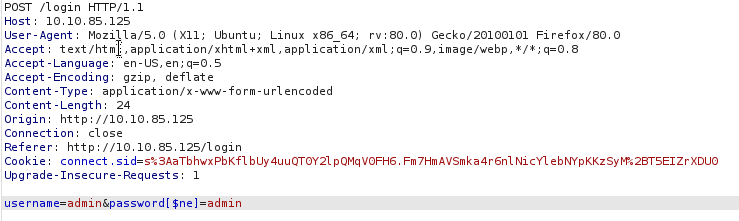
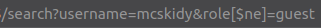

<h1>TryHackMe Christmas</h1>

[Home](index.html)

[toc]

#### Day 1

##### Insecure Direct Object Reference (IDOR) Vulnerability

TryHackMe IDOR room [here](https://tryhackme.com/room/idor)

A type of access control vulnerability, when an attacker can gain access to information or actions not indented for them. 

Occurs when a web server receives user supplied input to retrieve objects (file,data,documents). The web application does not validate whether user should have access to the requested object

##### Real World IDOR/Finding IDOR Vulnerabilities

Seeing a product, user, or service identifier in the URL is a must to test. 

**Find IDOR Vulnerabilities**

Changing user-supplied data

​	**Query Component** - data passed in the url when making a request to a website

```
https://website.com/profile?id=23
```

​    ^Protocol     ^Domain      ^Page      ^Query component

by changing the query component can we see other users data using a different ID ?

​	**Post Variables** - examining the contents of forms on a website can reveal fields that could be vulnerable to IDOR exploitation.

```
<form method="POST" action="/update-password">
    <input type="hidden" name"user_id" value="123">
    <div>New Password:</div>
    <div><input type="password" name="new_password"></div>
    <div><input type="submit" value="Change Password">
</form>
```

You can see from the input type line above that the users id is being passed to the webserver in a POST request. Can we change this to change a users password?

​	**Cookies** - Used to remember your session when connected to a website. webservers securely use these to retrieve user information.

sometimes these may store user information in the cookie itself such as user's ID. Changing the value of the cookie could display user information.

```
GET /user-information HTTP/1.1
Host: website.thm
Cookie: user_id=9
User-Agent: Mozilla/5.0 (Ubuntu;Linux) Firefox/94.0
```

---


#### Day 2

[Top](tryhackme_christmas.html)

##### Web Servers

TryHackMe Web Fundamentals [here](https://tryhackme.com/room/webfundamentals)

​	**HTTPS**

client-server protocol to provide communication between a client and a webserver

HTTP adds specific headers to the request to identify the protocol and other information.

- ​	Method and target header will always be included
  - ​    Target header will specify what to receive from the server
  - ​    Method header will specify how
    - ​    When retrieving information from a webserver you commonly use the Get method
    - ​    When sending information to a webserver you commonly use the Post method
- ​    Status codes tell the client browser how the webserver interpreted the request `HTTP 200 OK`

##### Cookies

used to distinguish your request from someone else's. Identifies different users and access levels. 

a tiny piece of meta data containing several types of data determined by the webserver developers

​	**Authentication/session cookies**

​	used to identify you and what access level is attached to your session on the webserver

 1. send a login request to a server

 2. webserver verifies that it received the data and sets/assigns a unique cookie

    all future requests will be automatically set with that cookie to identify you and your access level

3. Once webserver receives future get requests and cookies it will de-seralize your session

   Deserialization if the process of taking a data format such as JSON and rebuilding it as an object

There are several components that make up a cookie but we are only worried about the `name` and `value` since the others are handled by the webserver

Cookies are always prepared in pairs. `name-value` and `attribute-value`

Set-Cookie : `Set-Cookie: <cookie-name>=<cookie-value>; Domain=<domain-value>; Secure; HttpOnly`

​	**Cookie Manipulation**

​	taking a cookie an modifying it to obtain unintended behavior. They are stored locally on your host system, meaning you have complete control.

​	Open developer tools in your browser to find your cookies Application tab (Chrome) , Storage tab (Firefox)

1. Obtain a cookie value from registering or signing up for an account.
2. Decode the cookie value. [CyberChef](https://0x1.gitlab.io/code/CyberChef/)
3. Identify the object notation or structure of the cookie.
4. Change the parameters inside the object to a different parameter with a higher privilege level, such as admin or administrator.
5. Re-encode the cookie and insert the cookie into the value space; this can be done by double-clicking the value box.
6. Action the cookie; this can be done by refreshing the page or logging in.

  More on authentication bypass [here](https://tryhackme.com/jr/authenticationbypass)

---


#### Day 3

[Top](tryhackme_christmas.html)

##### Content Discovery

TryHackMe [Content Discovery](https://tryhackme.com/room/contentdiscovery)

the assets and inner workings of the application that we are testing such as files, folders, or pathways.

A useful technique allowing us to find things that were not suppose to see.

- Config files
- Passwords and secrets
- Backups
- Content management systems
- Administrator dashboards or portals

You can manually search for things like `admin` or `passwords.txt` or use `dirbuster` to automatically do this process

a wordlist will contain several common directory/files names to search for on a website, [SecLists](https://github.com/danielmiessler/SecLists) has a great collection.

Kali default = `/usr/share/wordlists`

`dirb <URL> <wordlist>`

##### Default Credentials

TryHackMe [Authentication Bypass](https://tryhackme.com/jr/authenticationbypass)

Sometimes devs leave default passwords on portals, its always a good idea to try common username/password combinations.

---


#### Day 4

[Top](tryhackme_christmas.html)

##### Authentication

A process of identifying a user's identity, establishing that they are who they say they are.

1. A known set of credentials to the server and user such as a username and password
2. Token authentication (these are unique pieces of encrypted text)
3. Biometric authentication (fingerprints, retina data, etc.)

TryHackMe [Principles of Security]()

##### Fuzzing

An automated means of testing an element of a web application until the application gives a vulnerability or valuable information. Used to test hundreds of credentials or other information using a wordlist to test the web applications response.

**Burp Suite Fuzzing**

1. Navigate to the site you want to fuzz

2. Launch Burp Suite

3. Navigate to the Proxy Tab and press `Intercept On`

4. Back in Firefox us the FoxyProxy Extension to turn on the Burp Proxy

5. Enter any random username::password combination 

6. Return to Burp Suite and you should see a post request with some information, including the username and password you entered

7. Right click the windows with the data and click `sent to intruder`

8. Inside the Intruder tab:

   1. Click on Positions and clear the pre-selected positions by pressing `clear &`

   2. Add the username value as the first position and the password value as the second position 

      Note: you can use a wordlist against usernames and passwords

      

   3. Select the `Cluster Bomb` in the "attack type" drop down 

   4. In the payloads tab under Payload Options [Simple List] load the wordlist/or type passwords you want to use to fuzz for each set in `Payload Set`

   5. Now press the `Start Attack` button, this will being fuzzing the login form.

      look at the results and sort by length. You can determine failed and successful attempts.

      

---


#### Day 5

[Top](tryhackme_christmas.html)

##### Cross-Site Scripting (XSS)

TryHackMe XSS [here](https://tryhackme.com/room/xssgi)

An injection attack where malicious JavaScript gets injected into a web application with the intention of being executed by other users

- stealing victims cookies
- running keyloggers
- redirecting 
- placing orders
- reseting passwords, etc.

<u>Four different types of XSS</u>

- **Document Object Model (DOM)**
  - a programming interface for HTML and XML documents
  - represents the page so that programs can change the document structure,sytle, and content

​		DOM based XSS is when javascript execution happens directly in the browswer without any new pages being loaded. Execution occurs when the websites Javascript code acts on input or user interaction.

- **Reflected**

  - happens when user-supplied data in an HTTP request is included in the webpage source without any validation

  - Example could be an error message which is in a query string of an url that is reflected onto the webpage

    - The error message could be replaced with JavaScript code which gets executed when a user visits the page

      ```
      https://website.thm/login?error=Username%20Is%20Incorrect
      ```

- **Stored**

  - The XSS payload is stored on the web application (in a database for example) and then gets ran when other users visit the site
  - Example could be a blog, if the message is not properly validated, then every visit to the blog page would run the malicious Javascript code.

- **Blind**

  - Similar to stored but you cannot see the payload working or be able to test against yourself first. 
  - Example could be a contact form, your message could contain an XSS payload, when a member views the message it could be executed

---


#### Day 6

[Top](tryhackme_christmas.html)

TryHackMe [file inclusion](https://tryhackme.com/room/fileinc)

##### Local File Inclusion (LFI)

found on various web applications that allows an attacker to include and read local files on the server. These files could include sensitive data. This happens due to a developers lack of security awareness, and lack of user input validation, which could be chained to Remote Code Execution (RCE)

PHP functions that cause this vulnerability

- include
- require
- include_once
- require_once

##### Identifying and Testing for LFI

[Top](tryhackme_christmas.html)

Usually interested in HTTP parameters to manipulate the input and inject attack payloads (GET/POST)

**Parameters** are query parameter strings attached to the URL that could be used to retrieve data or perform actions based on user input.


Its important to understand how the data is processed within the application. You can then test using manual or automated tools

Example of PHP code that is vulnerable

```
<?PHP
	include($_GET["file"]);
?>

PHP code uses a GET request via the URL parameter file to include a file on the page. 
http://example.com/index.php?file=secret.txt
```

Other entry points: <u>User-Agent, Cookies, session</u>, and other <u>HTTP headers</u>

Some examples of Linux system files that have sensative information

```
/etc/issue
/etc/passwd
/etc/shadow
/etc/group
/etc/hosts
/etc/motd
/etc/mysql/my.cnf
/proc/[0-9]*/fd/[0-9]*   (first number is the PID, second is the filedescriptor)
/proc/self/environ
/proc/version
/proc/cmdline
```

**Testing**

- A direct file inclusion, which starts with /etc/passwd
- using .. to get out the current directory, the number of .. is varies depending on the web app directory. 
- Bypassing filters using ....//.
- URL encoding techniques (such as double encoding)

```
http://example.thm.labs/page.php?file=/etc/passwd 
http://example.thm.labs/page.php?file=../../../../../../etc/passwd 
http://example.thm.labs/page.php?file=../../../../../../etc/passwd%00 
http://example.thm.labs/page.php?file=....//....//....//....//etc/passwd 
http://example.thm.labs/page.php?file=%252e%252e%252fetc%252fpasswd
```


**PHP Filter**

[Top](tryhackme_christmas.html)

wrapper is used in LFI to read the actual PHP page content, we can use this filter in encoding formats such as base64 or ROT13

```
http://10-10-250-88.p.thmlabs.com/index.php?err=php://filter/resource=/etc/passwd
```

now use base64 encoding

```
http://10-10-250-88.p.thmlabs.com/index.php?err=php://filter/convert.base64-encode/resource=/etc/passwd
```

Once you get encoded ouput use www.base64decode.org to decode


**PHP Data**

used to include raw plain text or base64 encoded data. Used to include images on the current page

```
echo "<what you want to encode with base64>" | base64

echo "Base64 code" | base64 --decode
```

Include base64 data into vulnerable page

```
 http://10-10-250-88.p.thmlabs.com/index.php?err=data://text/plain;base64,QW9DMyBpcyBmdW4hCg==
```


##### LFI to RCE via Log Files (log poisoning attack)

[Top](tryhackme_christmas.html)

Include a malicious payload into services log files such as Apache, SSH, etc. then the LFI vulnerability is used to request the page that includes the payload.

Users can include payloads into apache log file via User-Agent `(-A)` or other HTTP headers, or in the username section of SSH

```
Test User-Agent
curl -A "Test" http://10-10-250-88.p.thmlabs.com/index.php

Test User-Agent with PHP payload
curl -A "<?php phpinfo();?>" http://10-10-250-88.p.thmlabs.com/index.php
```

Now you can use LFI to view the log file

```
https://10-10-250-88.p.thmlabs.com/index.php?err=./includes/logs/app_access.log
```


##### LFI to RCE via PHP Sessions

PHP sessions are file within the operating system that store temporary information. After the user logs out of the web application the php session information will be deleted

This technique requires enumeration to read the PHP config files first to know where the php session file are.

<u>Common Locations:</u> 

- c:\Windows\Temp
- /tmp/
- /var/lib/php5
- /var/lib/php/session

We know from reading the php config from log poisoning that the php sessions are stored in the `/tmp` directory

Find PHP session file name the default naming scheme: `sess_<SESSION_ID>`

The session ID can be found in the browser in developer tools (CTRL + SHIFT + i), application tab, Cookies, select target website

`PHPSESSID : 3f7dj4vl4u0244807elgug8cb2`  

the file will be `sess_3f7dj4vl4u0244807elgug8cb2` in the `/tmp` directory

Now you can use LFI to call the session file

```
https://10-10-250-88.p.thmlabs.com/login.php?err=/tmp/sess_3f7dj4vl4u0244807elgug8cb2
```

---


#### Day 7

[Top](tryhackme_christmas.html)

##### NoSQL

a database that refers to non-relational database that is short for non SQl and Not Only SQL. A data-storing and data-retrieving system.

commonly used for big data and IoT devices due to fast queries, ease of use, scalability, and flexible data structure

<u>Databases</u>: MongoDB, Couchbase, RavenDB, etc..

**MongoDB** , free and popular document store NoSQL database (objects stored in format called BSON, supports JSON data types)

​	consists of different names compared to MySQL and MSSQL

| MongoDB     | MySQL Comparison |
| ----------- | ---------------- |
| Collections | Tables           |
| Documents   | Rows             |
| Fields      | Columns          |
| $and        | AND              |
| $or         | OR               |
| $eq         | =                |

##### Interacting with MongoDB server

1. ssh into mongoDB server 
2. type `mongo` to connect to server on the localmachine
3.  `> show databases`
   1. the `use` command can be used to connect to a database or create one
      - `use <newdb name>`
      - `db.createCollection("users")` function to create collections(tables) named "users"
      - `db.getCollectionName()` to view newly created collections(tables)
4. Create a document within the users collection(table) and insert data
   1. `db.users.insert({id: "1", username: "admin", email: "admin@thm.labs", password: "123"})`
      - `db.users.find()`show available information added. MongoDB automatically creates a unique ID
   2. `db.users.update({id: "1"}, {set: {username: "admin_new"}});` update with new information
      1. `db.users.find()` to verify update was successful
   3. `db.users.remove({'id':'1'})` remove id user
      - `db.users.find()` verify
      - `db.users.drop()`

#####  NoSQL Injection

[Top](tryhackme_christmas.html)

Web security vulnerability that allows the attacker to have control over the database. Happens when sending queries via untrusted and unfiltered web applicaiton input, which leads to unauthorized information.

**Bypassing Login Pages**

connect to database and then look for a certain username and password; if they exist then we have a valid entry.

<u>query</u>:

- ​	`db.users.findOne({username: "admin_new", password: "123"})`
  - successful returns documents, unsuccessful returns null

Before exploiting there are several operators that we need to be familir with used heavily with injections

| Operator | Description                               |
| -------- | ----------------------------------------- |
| $eq      | matches records equal to certain value    |
| $ne      | not equal                                 |
| $gt      | great than                                |
| $where   | based on javascript condition             |
| $exists  | matches records that have a certain field |
| $regex   | satisfy certain regular expressions       |

**Exploiting the Logic**

injecting JSON object which includes one of the NoSQL operators 

using `$ne` in the password field, find a document with the username equal to admin and the password is not equal to xyz, which returns TRUE because the password is not xyz

`db.users.findOne({username: "admin", password: {"$ne":"xyz"}})`

Eunumerate other fields

`db.users.findOne({username: {"$ne":"admin"}, password: {"$ne":"xyz}})`

**NoSQL injection within the web application**

1. find entry point that does not sanitize user's input
2. accept user's input as GET orPOST
   - inject arrays of th MongoDB operator to match the JSON objection to match the key: value.
   - `http://example.com/search?username=admin&role[$ne]=user`
   - this concept can also be applied to POST requests
3. you can also utalize JSON as user's input to exploit NoSQL




Using URL to find only roles


Using URL to find users



---


#### Day 8

[Top](tryhackme_christmas.html)

##### Powershell Transcription Logging

Capture input and output of windows powershell commands. Enabled in group policy, or the Windows registry below:

```
reg add HKEY_LOCAL_MACHINE\Software\Policies\Microsoft\Windows\PowerShell\Transcription /v EnableTranscripting /t REG_DWORD /d 0x1 /f
reg add HKEY_LOCAL_MACHINE\Software\Policies\Microsoft\Windows\PowerShell\Transcription /v OutputDirectory /t REG_SZ /d C:/ /f
reg add HKEY_LOCAL_MACHINE\Software\Policies\Microsoft\Windows\PowerShell\Transcription /v EnableInvocationHeader /t REG_DWORD /d 0x1 /f
```

Each transaction log is a simple plain text file. You can see commands and output of everything that was ran with Powershell

Connect to windows with rdp `xfreerdp /u:<username> /p:<password> /v:<IP>`

##### Living Off the Land  ([LOLbin](https://lolbas-project.github.io/))

use [CyberChef](https://0x1.gitlab.io/code/CyberChef/) to decode 

##### Shellbags

Microsoft registry keeps track of folder settings in order to enchance the users experience in ShellBags. Primary purpose is to improve user experience and remember preferences while browsing folders.

Important for forensics. 

Path `C:\Users\…..\AppData\Local\Microsoft\Windows`

Registry: `\HKEY_CLASSES_ROOT\LocalSettings\Software\Microsoft\Windows\Shell\Bags`

​	BagMRU - stores folder names and folder paths, root represented by 0

​	Bag - view preferences such as size of the window, location, and view mode

ShellBag Explorer - [Eric Zimmermans](https://ericzimmerman.github.io/#!index.md)

File > Open offline hive .dat or from Registry

​	you can see from the decoded .dat file we can see the file structure of the encoded file good for forensics

**UHA Archive**

similar to ZIP or RAR but faster and with better compression rates.
